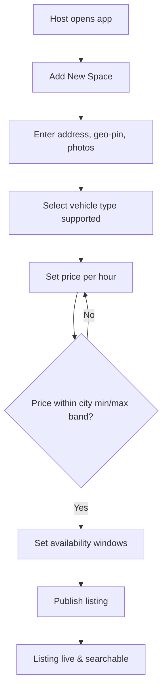
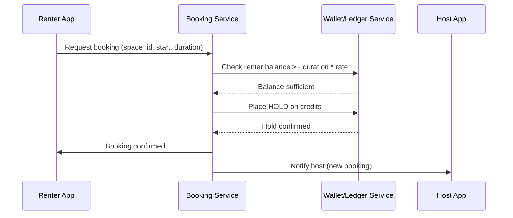
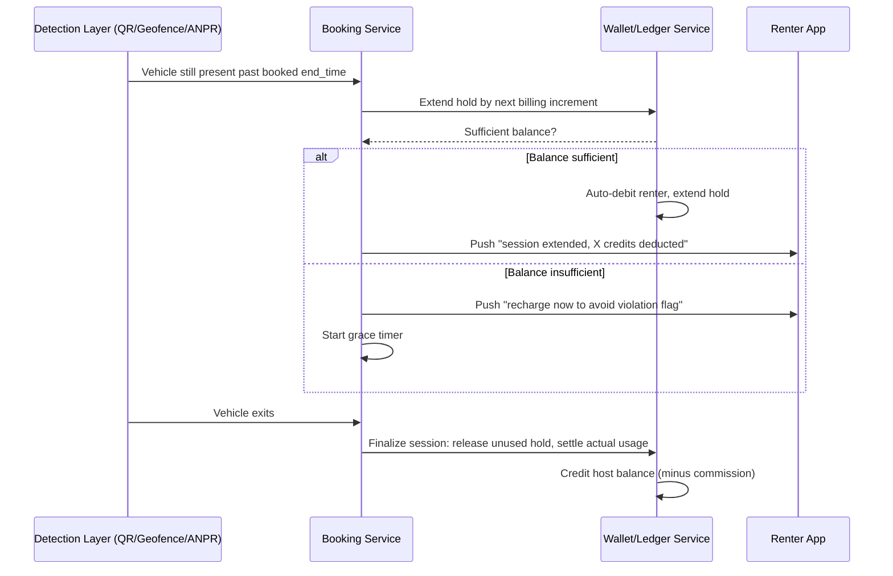
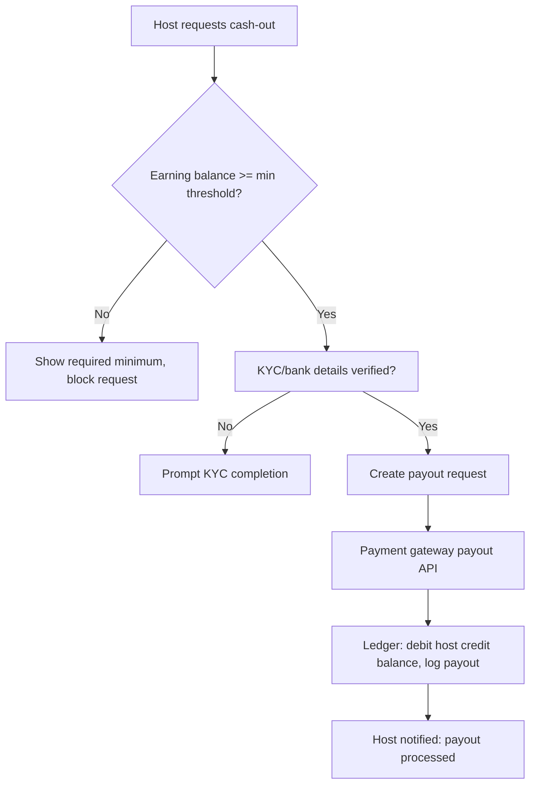
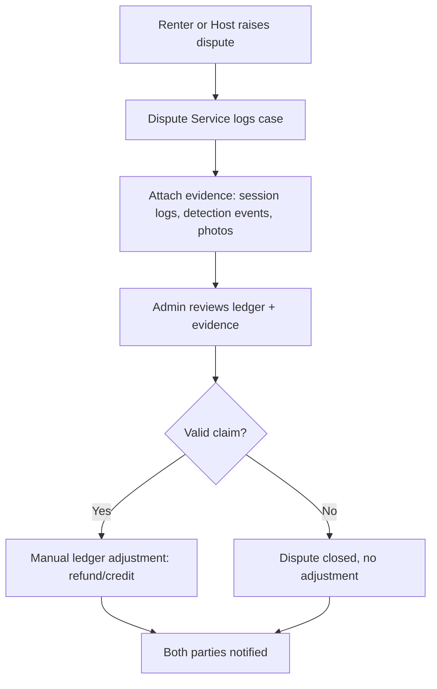
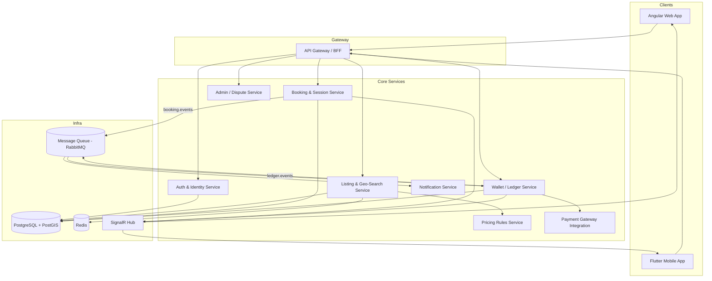

# ParkNest — Peer-to-Peer Parking Space Marketplace
### Product Requirements, Architecture & Implementation Blueprint

> Working name: **ParkNest** (rename freely). This document is written as a self-contained spec — vision, problem, solution, flows, data model, architecture, tech stack, and phased roadmap — so it can be handed directly to an implementation effort (solo or team) later.

---

## Table of Contents
1. [Executive Summary](#1-executive-summary)
2. [Problem Statement](#2-problem-statement)
3. [Vision](#3-vision)
4. [Solution Overview](#4-solution-overview)
5. [Core Innovation: Credit-Based Settlement](#5-core-innovation-credit-based-settlement)
6. [User Personas](#6-user-personas)
7. [Core Features](#7-core-features)
8. [Business Model](#8-business-model)
9. [Pricing Rules Engine](#9-pricing-rules-engine)
10. [User Flows](#10-user-flows)
11. [System Architecture](#11-system-architecture)
12. [Data Model](#12-data-model)
13. [Overstay Detection Mechanisms](#13-overstay-detection-mechanisms)
14. [Tech Stack](#14-tech-stack)
15. [Non-Functional Requirements](#15-non-functional-requirements)
16. [Regulatory & Compliance Considerations](#16-regulatory--compliance-considerations)
17. [Risks & Open Challenges](#17-risks--open-challenges)
18. [Implementation Roadmap](#18-implementation-roadmap)
19. [Success Metrics](#19-success-metrics)
20. [Glossary](#20-glossary)

---

## 1. Executive Summary

ParkNest is a two-sided marketplace that lets people rent out **vacant private space** (driveways, empty plots, basements, unused office/society parking) to drivers looking for parking, in the same way Airbnb turned spare rooms into a rental market. The platform's core differentiator is a **closed-loop, prepaid credit system** that removes the two biggest failure modes of any informal parking-rental arrangement:

- **Time overruns** ("booked 1 hour, stayed 2") — handled by automatic metering and auto-debit, not a manual argument at pickup.
- **Payment refusal** — impossible by design, because credits are locked/reserved *before* the parking session starts. There is no invoice to refuse; there is only a balance that unlocks.

Owners earn credits, which convert to real cash once they cross a minimum threshold. Renters recharge credits before they can book. A city-wise min/max price band prevents both predatory pricing and price gouging.

---

## 2. Problem Statement

- Millions of private vacant spaces (driveways, empty plots, underused society/office parking) sit idle for most of the day while drivers circle the block looking for parking.
- Informal/manual arrangements ("just pay me when you leave") break down in two predictable ways:
  1. **Duration disputes** — no objective record of actual time used, so overstays become arguments.
  2. **Payment risk** — the space owner has no leverage once the car has already left; cash collection depends entirely on the renter's honesty.
- Existing parking apps mostly aggregate *commercial* lots (paid parking structures), not underused *private* space — so there's a large supply-side gap, similar to the hotel-vs-Airbnb gap.

---

## 3. Vision

> Turn every idle private parking spot into a liquid, trustworthy, on-demand marketplace — where owners earn passively and drivers find parking in seconds, with zero friction or trust risk on either side, because money never has to be "collected," only released from a balance that already exists.

---

## 4. Solution Overview

A mobile-first (Flutter) + web (Angular) marketplace with three sides:

- **Hosts (Space Owners)** — list vacant space, set base pricing within city limits, earn credits per booking, convert credits to cash.
- **Renters (Drivers)** — search nearby space, recharge credits, book by time slot, get auto-billed accurately even on overstay.
- **Platform (Admin)** — sets city-wise pricing bands, resolves disputes, takes a commission, manages payouts and compliance.

The key structural idea: **the app never handles a "payment" between two people in real time.** It only moves numbers in an internal ledger between two already-funded (or earning) accounts. Real money only crosses the platform boundary twice: (a) when a renter recharges, and (b) when a host cashes out.

---

## 5. Core Innovation: Credit-Based Settlement

This is the heart of the product, so it's worth specifying precisely.

### 5.1 Principles
1. **Prepaid only.** A renter cannot book unless they hold enough credit balance to cover the *minimum* booking duration. No pay-later, no "settle at pickup."
2. **Hold, not just debit.** At booking time, the system places a **hold (soft-lock)** on credits equal to the booked duration × rate. This is not yet transferred to the host — it's reserved.
3. **Metered settlement at checkout.** When the session actually ends (detected via one of the mechanisms in §13), the system calculates *actual* duration:
   - If actual ≤ booked: release the unused hold back to the renter's spendable balance; transfer the used portion to the host's earning balance (minus platform commission).
   - If actual > booked: **auto-extend** the hold in real time, debiting additional credits at the overstay rate (can be same rate or a premium overstay rate) directly from the renter's main balance — no manual approval needed, since the renter agreed to this at time of booking (T&Cs).
4. **Insufficient balance during overstay.** If a renter's balance can't cover the overage:
   - Push a real-time alert (SignalR) asking them to recharge immediately.
   - Allow a small grace buffer (e.g., 10–15 minutes) before flagging the booking as "in violation."
   - Violations attach to the renter's trust score and can restrict future bookings until resolved — this replaces "chasing payment" with "restricting future access," which is enforceable, unlike chasing cash.
5. **No cash, no bank transfer, no UPI happens between host and renter, ever.** All settlement is internal ledger movement. This is what eliminates "refuses to pay" as a failure mode — there's no invoice to refuse, only a wallet that has already been decremented.
6. **Cash-out threshold.** Hosts accumulate credits and can convert to real payout (bank transfer/UPI) only above a minimum threshold (e.g., ₹500 equivalent) to keep payout transaction costs sane and to reduce micro-fraud/wash-trading incentives.
7. **Double-entry ledger.** Every credit movement is recorded as a paired debit/credit entry (renter debit ↔ host credit ↔ platform fee credit), append-only, so the whole system is auditable and reversible (refunds, disputes) without ever deleting history.

### 5.2 Why this design beats a normal payment gateway per-booking
- No per-transaction gateway fees on every micro-booking — only on recharge and payout (much lower frequency, better economics).
- No real-time payment authorization latency at checkout — settlement is just arithmetic on a balance you already control.
- No counterparty risk — a host never "waits" for a renter to pay; the money was reserved before the car ever parked.

---

## 6. User Personas

| Persona | Goal | Key Pain Point Solved |
|---|---|---|
| **Host** — e.g. homeowner with an empty driveway | Passive income from unused space | No manual cash collection, no chasing renters, guaranteed settlement |
| **Renter** — daily commuter / event visitor | Fast, cheap, nearby parking | No haggling, no surprise cash demand, transparent per-minute overstay billing |
| **Admin/Platform Ops** | Healthy, fraud-free marketplace | Dispute tooling, pricing guardrails, payout compliance |

---

## 7. Core Features

### Host-side
- List a space: photos, address/geo-pin, vehicle type supported (2W/4W), available time windows, base price/hr (constrained to city min/max band).
- Toggle availability / block out dates.
- Live earnings dashboard (locked vs. released credits).
- Cash-out request (above minimum threshold) → bank/UPI payout.
- Booking history, ratings on renters.

### Renter-side
- Geo-search nearby available spaces (map + list view), filter by price/vehicle type/distance.
- Wallet recharge (min recharge to activate account).
- Book a slot → credits placed on hold.
- Live session timer with overstay warning push notifications.
- Auto-extension billing, session receipt (ledger entries), ratings on hosts.

### Platform/Admin
- City-wise min/max pricing configuration.
- Dispute resolution console (overstay disagreements, space-not-as-described, no-shows).
- Fraud/anomaly detection (wash trading between linked accounts, GPS spoofing).
- Payout & compliance dashboard (KYC status, PPI-threshold monitoring — see §16).
- Commission/fee configuration.

---

## 8. Business Model

**Revenue streams:**
1. **Commission per completed booking** (e.g., 10–15% of the credit value transferred, deducted at settlement, before crediting host).
2. **Cash-out/payout fee** (small flat or % fee on host conversion to real money) — optional, or absorbed as cost of doing business depending on competitive positioning.
3. **Surge/premium listing** — hosts can pay to feature their space higher in search results for high-demand zones (e.g., near stadiums/malls on event days).
4. **B2B parking** — offer the same engine to housing societies / office parks to monetize excess parking (bulk deals, subscription passes).

**Cost centers:** payment gateway fees on recharge/payout, cloud infra, KYC/AML compliance tooling, customer support/dispute ops, city ops (verifying pricing bands, seeding supply).

---

## 9. Pricing Rules Engine

- Each **city** has a configured `min_price_per_hour` and `max_price_per_hour`, potentially segmented by **vehicle type** (2-wheeler vs 4-wheeler) and possibly by **zone tier** (e.g., "central business district" vs "suburb") for more granular control later.
- When a host sets a listing price, the app validates it against the active band for that city/zone/vehicle-type before allowing publish.
- Admin can update bands centrally (e.g., seasonal demand, festival surge caps) without a code deploy — this must be **data-driven config**, not hardcoded.
- Overstay rate can be same as base rate, or a configurable multiplier (e.g., 1.25×) to discourage chronic overstaying — also within a platform-defined ceiling so hosts can't punitively overcharge stuck renters.

---

## 10. User Flows

### 10.1 Host Listing Flow

### 10.2 Booking & Credit Hold Flow

### 10.3 Overstay Auto-Debit Flow

### 10.4 Credit-to-Cash Conversion Flow

### 10.5 Dispute Flow

---

## 11. System Architecture

High-level microservice decomposition (works equally well as a modular monolith for MVP — see §18):

**Why event-driven (RabbitMQ) between Booking and Wallet:** booking-session-end and wallet-settlement are naturally decoupled — the booking service shouldn't block on ledger writes, and the wallet service is the single source of truth for money movement so it should own its own consistency boundary. This also makes the ledger replayable/auditable.

**Why SignalR:** live session timers, overstay warnings, and "credits deducted" pushes need low-latency real-time delivery to the renter's phone — a natural fit given it's already in your toolkit.

---

## 12. Data Model

Core entities (simplified — not full DDL):

- **User**(id, role[Host/Renter/Both], name, phone, email, kyc_status, trust_score)
- **Vehicle**(id, user_id, plate_number, type[2W/4W])
- **ParkingSpace**(id, host_id, geo_point [PostGIS], address, vehicle_types_supported, price_per_hour, photos[], availability_windows, status)
- **Booking**(id, space_id, renter_id, start_time, expected_end_time, actual_end_time, status[Held/Active/Completed/Disputed/Cancelled], detection_method)
- **Wallet**(id, user_id, spendable_balance, held_balance, earning_balance)
- **LedgerEntry**(id, wallet_id, booking_id?, type[Recharge/Hold/Release/OverstayDebit/HostCredit/PlatformFee/Payout/Refund], amount, direction[Debit/Credit], created_at) — **append-only, double-entry**
- **CityPricingConfig**(id, city, vehicle_type, min_price_per_hour, max_price_per_hour, overstay_multiplier)
- **Payout**(id, host_id, amount, bank_details_ref, status, created_at)
- **Dispute**(id, booking_id, raised_by, reason, evidence[], resolution, status)
- **Rating**(id, booking_id, from_user_id, to_user_id, score, comment)

---

## 13. Overstay Detection Mechanisms

This is the hardest engineering problem in the product — the credit system is only as trustworthy as the *time measurement* feeding it. Three tiers, cheapest → most robust:

### Tier 1 — Manual/App-Confirmed (MVP)
- Renter taps "I've parked" / "I'm leaving" in-app; timestamps drive billing.
- Cheap, zero hardware, but relies on renter honesty for the *end* event (they're incentivized to under-report duration).
- Mitigate with: host counter-confirmation, or a short GPS-based "are you still near this location?" ping before allowing "leaving" to be honored without an overstay flag.

### Tier 2 — Geofencing + QR Checkout
- QR code posted at the space; renter scans on entry and exit. Combined with phone GPS geofence validation (must be within N meters of the space's geo-pin to scan) to prevent spoofing.
- Removes most manual disputes at low cost — no hardware beyond a printed QR sticker.

### Tier 3 — ANPR / IoT Sensor (Advanced)
- A low-cost camera running number-plate recognition at the space entrance/exit — automatically timestamps actual entry/exit per vehicle, matched against the booking's registered plate number.
- Alternative/complement: ultrasonic or magnetic occupancy sensor for a binary "space occupied" signal without needing plate identification.
- This is a genuine technical differentiator versus generic "Airbnb for parking" clones, since most competitors won't invest in in-house computer-vision/detection pipelines. It requires either in-house CV/ML expertise or a specialized third-party ANPR vendor, and is best justified once the marketplace has enough liquidity at a location to make hardware investment worthwhile.

**Recommended approach:** ship Tier 1 for MVP (fast, no hardware dependency), move power-users/high-value spaces to Tier 2, and pilot Tier 3 in a handful of high-traffic locations once there's proof the marketplace has liquidity worth defending with hardware investment.

---

## 14. Tech Stack

### 14.1 Recommended Stack — aligned to your current expertise
*(Fastest path to a working product using stack you already operate daily)*

| Layer | Choice | Notes |
|---|---|---|
| Web frontend | **Angular** | Admin dashboard + host web console |
| Mobile app | **Flutter** | Single codebase, iOS + Android for hosts & renters |
| Backend API | **.NET 8 (ASP.NET Core Web API)** | Clean Architecture / modular monolith to start |
| Database | **PostgreSQL + PostGIS extension** | PostGIS is essential for geo-search ("spaces near me") |
| Message queue | **RabbitMQ** | Booking ↔ Wallet ↔ Notification decoupling |
| Real-time | **SignalR** | Live session timers, overstay push, wallet updates |
| Cache | **Redis** | Geo-search result caching, session state, rate limiting |
| Auth | **Duende IdentityServer** or **Keycloak** | OAuth2/OIDC, supports mobile + web clients |
| Payments | **Razorpay** or **Cashfree** | India-first, supports UPI for recharge & payout |
| Push notifications | **Firebase Cloud Messaging** | Cross-platform mobile push |
| Containerization | **Docker** (+ Docker Compose for MVP, Kubernetes later) | You already use Docker |
| Observability | **Prometheus + Grafana** | Already your toolkit; extend with alerting rules on ledger anomalies |
| CI/CD | **GitHub Actions** | Simple, integrates with Docker registries |
| API Gateway | **YARP** (.NET reverse proxy) or **Ocelot** | Keeps everything in the .NET ecosystem |

### 14.2 "Most Advanced" Stack — if optimizing for scale/rigor over familiarity

| Layer | Choice | Why |
|---|---|---|
| Core ledger service | **Rust or Go**, event-sourced, CQRS | Ledger correctness/performance matters more than developer familiarity at scale; event sourcing gives full auditability of every credit movement |
| Other services | **.NET 8** (keep for business-logic-heavy services) | No need to rewrite everything — polyglot where it earns its keep |
| Event streaming | **Kafka** (instead of RabbitMQ) | Higher throughput, replayable event log — valuable specifically for the ledger's audit trail |
| Database | **PostgreSQL + PostGIS** (OLTP) + **TimescaleDB** (occupancy/time-series) | Time-series extension for sensor/occupancy data at scale |
| Search | **Elasticsearch** | Faceted space search (price, distance, rating, amenities) at scale |
| Geo | **Mapbox** or **Google Maps Platform** | Richer map UX, routing to space |
| ANPR/CV pipeline | **OpenCV / a trained plate-recognition model** on edge devices (e.g., NVIDIA Jetson) at pilot locations | Requires dedicated CV/ML expertise in-house or via a specialized vendor partnership |
| Infra orchestration | **Kubernetes + Istio service mesh** | Traffic shaping, mTLS between services, canary deploys |
| IaC | **Terraform** | Reproducible infra across environments |
| Observability | **OpenTelemetry** + Grafana stack (**Loki**, **Tempo**, **Mimir**) | Unified traces/logs/metrics beyond Prometheus alone |
| Fraud/anomaly detection | Lightweight **ML model** (e.g., isolation forest) on ledger/booking patterns | Detect wash trading, GPS spoofing, collusion between linked accounts |

**Practical guidance:** start entirely with §14.1. The advanced stack is a *migration target* for specific bottlenecks (ledger throughput, search relevance, fraud detection) — not a day-one requirement. Rewriting the ledger service in Rust/Go only pays off once transaction volume actually stresses .NET+Postgres, which will be well past MVP.

---

## 15. Non-Functional Requirements

- **Consistency of the ledger is non-negotiable.** Use database transactions / the outbox pattern for any operation that touches wallet balances, so a crashed process can never leave a "hold" without a matching booking, or a debit without a matching credit.
- **Idempotency** on all booking/wallet-mutating endpoints (renter's phone losing signal mid-checkout should not double-debit).
- **Geo-search latency** target < 300ms for "spaces near me" queries — index PostGIS geometry columns (GiST index).
- **Real-time delivery** (SignalR) should degrade gracefully to push notification if the socket connection drops (renter closes app mid-session).
- **Horizontal scalability** on Booking/Listing services (stateless); Wallet/Ledger service can remain a smaller, more tightly consistent core.
- **Data retention**: ledger entries retained indefinitely (financial audit trail); booking/session logs retained per applicable data-retention policy.

---

## 16. Regulatory & Compliance Considerations

Flagging this explicitly because it materially affects the architecture, not just the legal paperwork:

- **A credit balance that converts to real cash resembles a Prepaid Payment Instrument (PPI)** under RBI regulations in India. Depending on transaction volume and structure, this can trigger licensing/registration requirements (e.g., via RBI-authorized PPI issuance, or partnering with an already-licensed payment aggregator/wallet provider instead of building your own wallet ledger as a money-like instrument).
- Practical mitigation many marketplaces use: **partner with a licensed payment aggregator/escrow provider** (e.g., a nodal/escrow account setup through Razorpay/Cashfree) so the platform's "credits" are an internal accounting representation *on top of* a compliant escrow account, rather than the platform itself functioning as a wallet issuer.
- **KYC** will likely be required before payout (host cash-out), per standard AML practice.
- This is a genuinely important early decision — worth a real consultation with a fintech-focused lawyer or compliance consultant before scaling recharge/payout volume, since retrofitting compliance after volume grows is significantly harder than designing for it from the start. Nothing above should be taken as legal advice — it's flagged here purely so the architecture doesn't paint you into a corner.

---

## 17. Risks & Open Challenges

| Risk | Mitigation Direction |
|---|---|
| Overstay detection accuracy (Tier 1 MVP relies on honesty) | Progressive rollout of Tier 2/3 detection in high-value zones; trust-score penalties for repeat under-reporting |
| Wash trading (host & renter collude to cycle credits into cash) | Anomaly detection on repeat pairings, minimum unique-counterparty thresholds before payout eligibility |
| GPS spoofing for check-in/out | Combine GPS with QR/ANPR corroboration for high-value spaces |
| Regulatory reclassification as a wallet/PPI | Escrow/aggregator partnership model (§16) |
| Cold-start liquidity (no renters without hosts, no hosts without renters) | Seed supply manually in 1–2 dense neighborhoods before opening renter demand broadly |
| Pricing band gaming (hosts collude at max price) | Platform can monitor city-level average realized price vs. band ceiling and adjust bands dynamically |
| Dispute volume overwhelming manual ops | Auto-resolve low-ambiguity cases using detection-tier evidence; escalate only ambiguous Tier-1 cases to humans |

---

## 18. Implementation Roadmap

### Phase 0 — MVP (single city, manual detection)
- Core services: Auth, Listing, Booking, Wallet (modular monolith in .NET is fine here — don't over-microservice on day one).
- Tier 1 overstay detection (app-confirmed check-in/out).
- Manual admin dispute console.
- Razorpay/Cashfree integration for recharge + payout, routed through their escrow/aggregator model (not a self-built wallet).
- Flutter app (renter + host in one app, role-based views) + a lightweight Angular admin panel.

### Phase 1 — Trust & Scale hardening
- Introduce RabbitMQ event decoupling between Booking and Wallet.
- SignalR live session tracking + overstay push alerts.
- Tier 2 detection (QR + geofence) for participating hosts.
- Trust score, ratings, dispute evidence attachments.
- Prometheus/Grafana dashboards on booking volume, ledger health, dispute rate.

### Phase 2 — Multi-city expansion
- City-wise pricing config service, dynamic band management.
- PostGIS-optimized geo-search at scale, caching via Redis.
- Formalize compliance posture (KYC flows, escrow partnership finalized).
- B2B pilot (housing societies/office parks).

### Phase 3 — Advanced differentiation
- Tier 3 ANPR/IoT detection pilot in select high-density locations.
- Move ledger to event-sourced/CQRS model if transaction volume demands it.
- ML-based fraud/anomaly detection on ledger patterns.
- Kubernetes migration if service count and scale justify the operational overhead.

---

## 19. Success Metrics

- **Supply-side liquidity:** number of active listings per city, average listing utilization rate (hours booked / hours available).
- **Demand-side:** booking completion rate, repeat renter rate.
- **Trust system health:** dispute rate per 1,000 bookings, % of bookings resolved without manual intervention.
- **Financial:** recharge-to-spend velocity, average host cash-out size, platform take-rate realized vs. target.
- **Overstay accuracy:** % of sessions where actual duration required manual dispute resolution (should trend down as Tier 2/3 detection rolls out).

---

## 20. Glossary

- **Hold (soft-lock):** credits reserved against a booking but not yet transferred to the host.
- **Settlement:** the act of finalizing a booking's actual usage and moving credits from hold → host earning balance.
- **Ledger entry:** an immutable, double-entry record of any credit movement.
- **PPI:** Prepaid Payment Instrument — an RBI-regulated category of instrument that stores monetary value for future use (relevant to §16).
- **Trust score:** a per-user reputation signal derived from overstay incidents, disputes, and ratings, used to gate booking privileges.

---

*End of document. This is meant as a living spec — update pricing bands, tech choices, and phase boundaries as real usage data comes in.*
